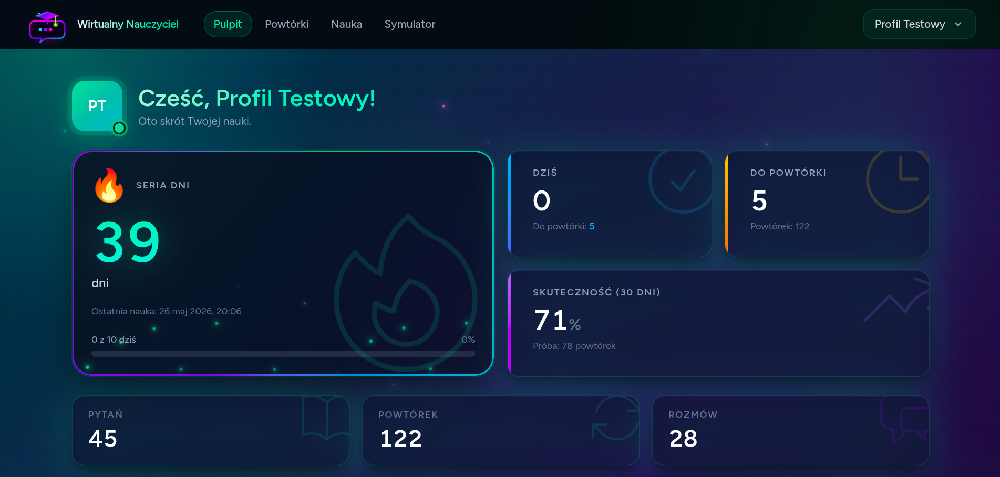
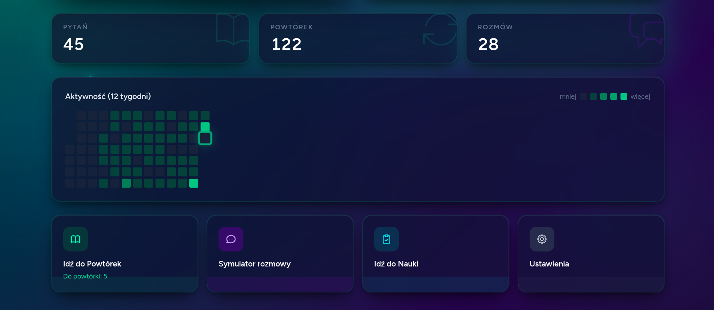
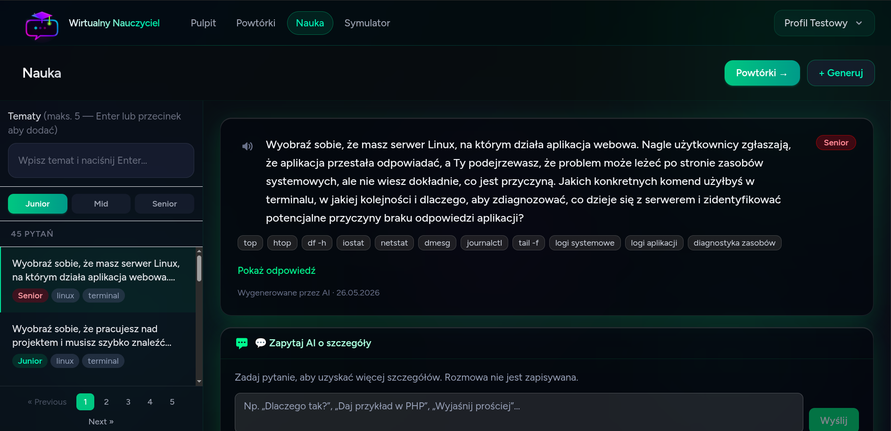
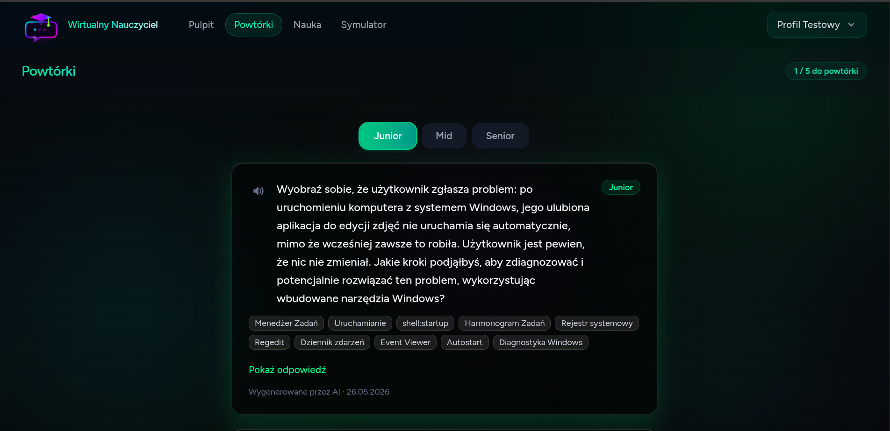
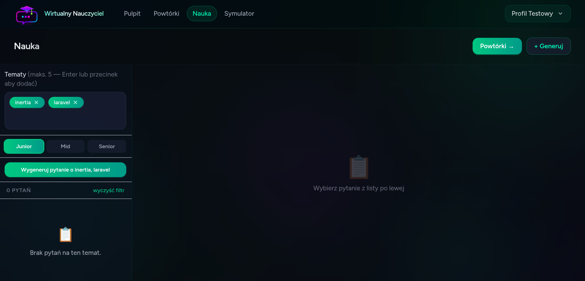
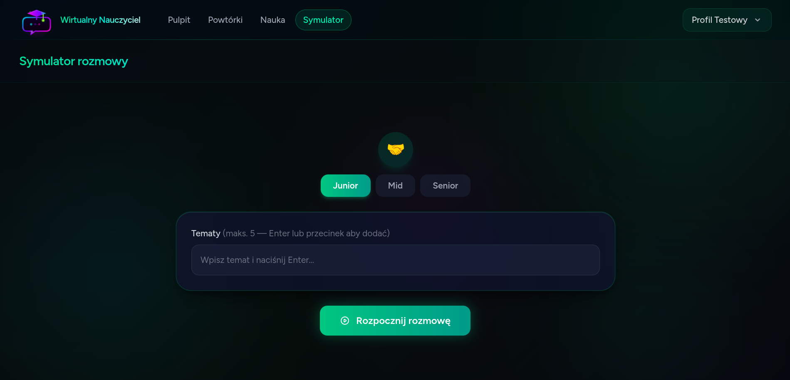
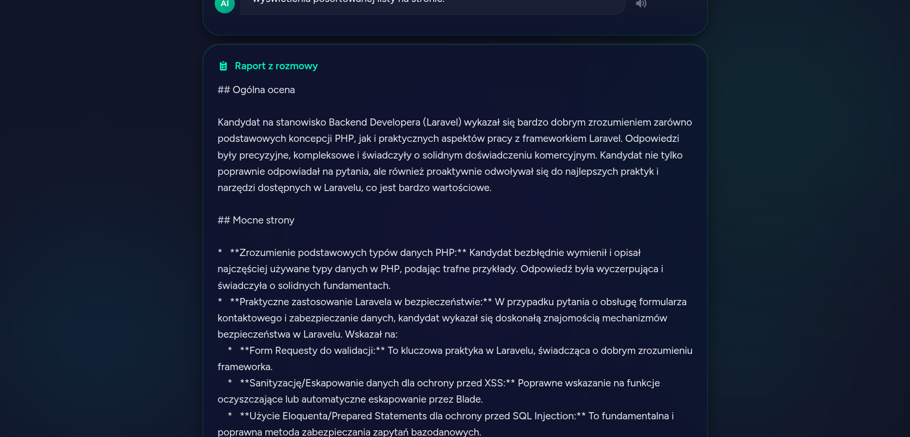

# PrepMind — Inteligentny trening do rozmowy technicznej

[](https://github.com/daniel-ciupek/AI-Powered-Tech-Interview-Prep-App/actions/workflows/ci.yml)


PrepMind to pełnostackowa aplikacja SPA dla programistów szukających pracy — generuje techniczne pytania rekrutacyjne dopasowane do Twojego poziomu i stosu technologicznego, planuje ich powtórki algorytmem **SM-2** i pozwala przeprowadzić prawdziwą rozmowę kwalifikacyjną z **AI-rekruterem**, który na końcu wystawia pisemną ocenę kandydata. Klucz Gemini dostarczasz sam (model **BYOK**) — żadnych abonamentów.

---

## Zrzuty ekranu

<table>
  <tr>
    <td align="center">
      
      <br/><sub><b>Pulpit</b> — seria dni, dzisiejszy cel, skuteczność 30-dniowa</sub>
    </td>
    <td align="center">
      
      <br/><sub><b>Mapa aktywności</b> — 12-tygodniowy heatmap + szybkie akcje</sub>
    </td>
  </tr>
  <tr>
    <td align="center">
      
      <br/><sub><b>Sesja nauki</b> — układ master-detail, czat AI przy każdym pytaniu</sub>
    </td>
    <td align="center">
      
      <br/><sub><b>Powtórki SM-2</b> — fiszka z chmurą tagów i oceną jakości (0–5)</sub>
    </td>
  </tr>
  <tr>
    <td align="center">
      
      <br/><sub><b>Baza pytań</b> — panel boczny z filtrami tematów i poziomów</sub>
    </td>
    <td align="center">
      
      <br/><sub><b>Symulator rozmowy</b> — wybór poziomu, dowolne tematy jako tagi</sub>
    </td>
  </tr>
  <tr>
    <td align="center" colspan="2">
      
      <br/><sub><b>Raport AI</b> — strukturowana ocena: ogólna ocena, mocne strony, rekomendacja</sub>
    </td>
  </tr>
</table>

---

## Funkcjonalności

- 🧠 **Generowanie pytań przez AI** — Gemini 2.5 Flash, zakres dopasowany do poziomu (Junior / Mid / Senior) i dowolnej listy tematów wpisanych przez użytkownika.
- 🔁 **Powtórki rozłożone w czasie** — silnik SM-2 planuje każde pytanie; codzienne sesje pokazują tylko to, co jest należne danego dnia.
- 💬 **Symulator rozmowy kwalifikacyjnej** — wieloturowa rozmowa z AI-rekruterką „Anną", kończąca się strukturalnym raportem oceny kandydata.
- 🗣️ **Czat AI przy pytaniach** — możliwość dopytania AI o dowolny aspekt pytania podczas nauki (wyjaśnienie, przykład, hint).
- 📊 **Osobisty pulpit** — seria dni, dzienny cel, skuteczność 30-dniowa, 12-tygodniowy heatmap aktywności.
- 🎯 **Onboarding wizard** — 4-krokowy kreator (poziom, tematy, klucz API, cel dzienny) blokuje dostęp do funkcji do czasu ukończenia.
- 🌗 **Dark mode bez FOUC** — preferencja zapisywana per użytkownik, stosowana przed renderem przez inline script.
- 🌍 **Polski + angielski** — `vue-i18n` na frontendzie, tłumaczenia Laravel na backendzie (błędy, walidacja).
- 📱 **Instalowalna PWA** — manifest, ikony, service worker, offline shell, strategia `NetworkOnly` — SPA zawsze serwuje świeży HTML.
- 🔊 **Text-to-speech** — Web Speech API; jedno kliknięcie odczytuje dowolne pytanie lub odpowiedź AI.
- 🔐 **Zaszyfrowany BYOK** — klucz Gemini użytkownika szyfrowany przez `Crypt::encryptString`, pole z atrybutem `#[Hidden]`, nigdy nie pojawia się w logach.
- ⚡ **Cache odpowiedzi AI** — wyniki Gemini cachowane na 7 dni per użytkownik (klucz: `sha256(prompt)`), zmniejsza zużycie tokenów przy powtarzających się pytaniach.

---

## Architektura

Aplikacja stosuje wzorzec **thin controller / fat action**. Kontrolery delegują do
**inwokowanych klas Action** (`app/Actions/{Domena}/…`), które korzystają z
**Serwisów** (`app/Services/{Domena}/…`) do zagadnień przekrojowych — klient Gemini,
silnik SM-2, cache odpowiedzi AI. Modele Eloquent przechowują relacje i casty;
logika biznesowa pozostaje poza nimi.

```
HTTP → FormRequest → Controller → Action → Service → Model → DB
                                       ↓
                                     Event → Listener (seria dni, joby)
```

Kluczowe decyzje architektoniczne:

- **Actions** są `final` i `__invoke`-owane. Przykłady: `GenerateQuestionAction`,
  `RecordReviewAction`, `LoadDashboardStatsAction`, `SendMessageAction`.
- **Policies** egzekwują autoryzację per wiersz (`QuestionPolicy`, `InterviewSessionPolicy`).
- **Rate limiterzy** nazwane w `AppServiceProvider` (`interview-start: 3/min`,
  `interview-message: 60/min`, `question-generate: 10/min`) przypisane do konkretnych tras API.
- **Raport po rozmowie** generowany przez `GenerateInterviewReportJob` uruchamiany przez
  `dispatchAfterResponse` — odpowiedź HTTP wraca do użytkownika natychmiast, raport
  powstaje po zakończeniu cyklu żądania.
- **Atomowe zapisy wiadomości** — `SendMessageAction` buduje historię czatu w pamięci
  (bez zapisu do DB), wywołuje Gemini, a dopiero po udanej odpowiedzi zapisuje obie
  wiadomości (user + assistant) w jednej `DB::transaction`.
- **Middleware** `EnsureUserIsOnboarded` blokuje strony funkcji do czasu ukończenia
  kreatora, zostawiając `PATCH /settings` i `POST /settings/api-key` dostępne z
  wnętrza kreatora.

---

## Stack technologiczny

| Warstwa | Wybór |
|---|---|
| Backend | Laravel 12 · PHP 8.3 |
| Baza danych | PostgreSQL 16 (używa `jsonb`, `jsonb_array_elements_text`) |
| Cache & Queue | Redis 7 |
| Frontend | Inertia.js 2 · Vue 3 (Composition API + `<script setup lang="ts">`) |
| Stan aplikacji | Pinia 3 |
| Stylowanie | Tailwind CSS 3 z `darkMode: 'class'` |
| Autentykacja | Laravel Breeze (preset Inertia + Vue) |
| Internacjonalizacja | vue-i18n 11 (frontend) · Laravel lang files (backend) |
| AI | Google Gemini 2.5 Flash (BYOK, `thinkingBudget: 0`) |
| PWA | `vite-plugin-pwa` 1 z inline Workbox runtime |
| Testy | Pest 3 (Feature + Unit), 159 testów, ≥93% pokrycie domeny |
| Jakość kodu | Pint · Larastan poziom 8 · Husky + lint-staged · gitleaks · commitlint |
| Środowisko dev | Laravel Sail (Docker) |

---

## Szybki start

```bash
git clone https://github.com/daniel-ciupek/AI-Powered-Tech-Interview-Prep-App
cd "AI-Powered-Tech-Interview-Prep-App"
cp .env.example .env

./vendor/bin/sail up -d
./vendor/bin/sail composer install
./vendor/bin/sail npm install
./vendor/bin/sail php artisan key:generate
./vendor/bin/sail php artisan migrate --seed
./vendor/bin/sail npm run dev
```

Aplikacja dostępna pod adresem <http://localhost>.

Zaloguj się jako `test@example.com` / `password` (konto seedowane) lub utwórz nowe.
Przejdź przez 4-krokowy kreator onboardingu — w kroku 3 wklej klucz API Gemini
z [Google AI Studio](https://aistudio.google.com/apikey).

### Build PWA

```bash
./vendor/bin/sail npm run build
```

Generuje `public/build/`, następnie `scripts/post-build-pwa.mjs` przepisuje
precache URLs w service workerze na ścieżki bezwzględne i kopiuje `sw.js` oraz
`manifest.webmanifest` do katalogu publicznego, żeby SW mógł objąć zakresem `/`.

---

## Testy

```bash
./vendor/bin/sail composer test             # Pest (równolegle)
./vendor/bin/sail composer test:coverage    # z bramką ≥80%
./vendor/bin/sail composer test:all         # Pint --test + Larastan + Pest
```

Zakres testów:

| Obszar | Pokrycie | Opis |
|---|---|---|
| Silnik SM-2 | 100% | Wszystkie krawędziowe przypadki: q=0..5, EF min, repetitions 0/1/2+ |
| Actions (Gemini) | ≥93% | `Http::fake()` — żadnych prawdziwych wywołań API w testach |
| Interview flow | pełny | Start → wiadomości → zakończenie → raport → retry |
| Rate limiting | ✅ | Testy blokady 429 per user |
| Policies | ✅ | Autoryzacja per wiersz (own vs. other) |

---

## Workflow deweloperski

```bash
./vendor/bin/sail composer lint           # Pint auto-fix
./vendor/bin/sail composer lint:check     # Pint bez zapisu (CI)
./vendor/bin/sail composer analyse        # Larastan poziom 8
./vendor/bin/sail composer test           # Pest (równolegle)
./vendor/bin/sail composer test:coverage  # bramka ≥80%
./vendor/bin/sail composer test:all       # pełny check (lint + analyse + test)
```

Hooki git (Husky + lint-staged + commitlint + gitleaks) egzekwują styl,
skanowanie sekretów i Conventional Commits przy każdym commicie;
pre-push uruchamia ponownie pełny pakiet Pest.

---

## Wdrożenie produkcyjne

Pełna instrukcja: [DEPLOY.md](DEPLOY.md) — Ubuntu 24.04 VPS, natywny PHP-FPM,
nginx, Postgres 16, Redis 7, supervisor dla kolejek i wdrożenie w stylu
releases-symlink z jednolinijkowym rollbackiem.

---

## Bezpieczeństwo

- **BYOK** — klucz Gemini szyfrowany przez `Crypt::encryptString`, pole z atrybutem `#[Hidden]`, nigdy nie trafia do logów.
- **Walidacja** — każda mutacja przez `FormRequest`; modele używają `$fillable` (whitelist), nigdy `$guarded = []`.
- **Autoryzacja** — `QuestionPolicy` i `InterviewSessionPolicy` blokują dostęp do cudzych zasobów na poziomie wiersza.
- **Nagłówki HTTP** — CSP, `X-Frame-Options`, `X-Content-Type-Options` w middleware.
- **Skanowanie sekretów** — `gitleaks` w pre-commit hooku; `composer audit` + `npm audit` w CI.
- **CSRF** — Sanctum SPA mode, Inertia obsługuje token automatycznie.
- **Markdown AI** — output Gemini renderowany przez `league/commonmark` w trybie strict; nigdy `v-html` z surowym tekstem AI.

---

## Internacjonalizacja

PrepMind jest dwujęzyczny (polski jako pierwszy, angielski jako fallback) od końca do końca.

- **Frontend** (Vue 3 + Inertia) — `resources/js/i18n/locales/{pl,en}/*.json`,
  automatycznie ładowane przez `resources/js/i18n/index.ts` przez `import.meta.glob`.
  Każdy plik JSON to przestrzeń nazw: `auth.json` → `$t('auth.login.submit')`.
  Zamontowane w `app.ts` z `legacy: false`, locale `pl`, fallback `en`.
- **Backend** (Laravel) — `lang/{pl,en}/*.php` (auth, validation, passwords, pagination
  oraz `messages.php` dla komunikatów AI/API). Kontrolery i FormRequesty używają `__('messages.…')`.

**Dodawanie nowego języka:** skopiuj `lang/pl/` → `lang/xx/`, skopiuj
`resources/js/i18n/locales/pl/` → `…/xx/`, przetłumacz wartości, ustaw `APP_LOCALE=xx`.

---

## System tagów

Tagi tematyczne na `interview_sessions.topic_tags` (jsonb) są **swobodnym tekstem** —
użytkownicy wpisują dowolny temat. Strona Vue używa `Components/FreeTextTagInput.vue`
(podgląd chipów + HTML5 `<datalist>` z podpowiedziami). `GET /api/tags` agreguje
30 najczęściej używanych tagów przez PostgreSQL `jsonb_array_elements_text`
i cachuje przez 10 minut.

---

## Licencja

[MIT](LICENSE)
